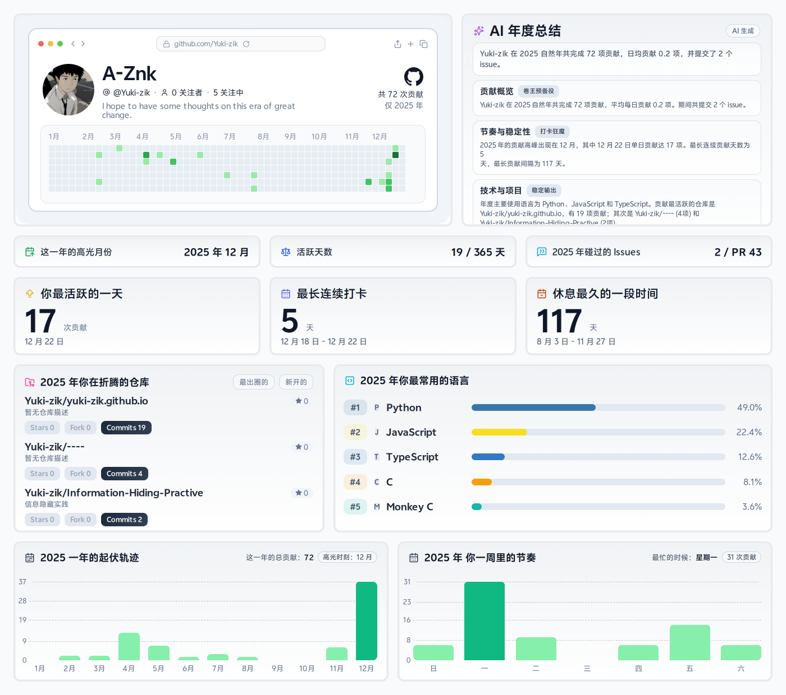

<div align="center">

[English](README.md) | [简体中文](README.zh-CN.md)

</div>

# GitHub Annual Report Generator

An automated tool to generate your personal GitHub annual report, featuring rolling 365-day statistics, AI-powered summaries, and beautiful visualizations.

<p align="center">
  
</p>

## Features

- 📊 **Rolling Stats**: Tracks your last 365 days of activity by default, perfectly capturing your recent momentum.
- 🤖 **AI Summary**: Uses OpenAI to analyze your activity and generate a personalized annual review (with fallback rules).
- 🖼️ **High-Quality Assets**: Generates retina-ready PNG and GitHub-compatible SVG reports.
- ⚡ **Fully Automated**: Runs weekly via GitHub Actions to keep your profile fresh.

## Quick Start

### 1. Create Repository
Click **[Use this template](https://github.com/new?template_name=github-annual-report-generator&template_owner=Yuki-zik)** to create a new repository from this template.

### 2. Configure Secrets
Go to `Settings > Secrets and variables > Actions` and add the following repository secrets:

| Secret Name | Required | Description |
|---|---|---|
| `GH_STATS_TOKEN` | **Yes** | A GitHub Personal Access Token (PAT). Scopes: `read:user`, `repo`, `read:org`. |
| `OPENAI_API_KEY` | No | OpenAI API Key. Required for AI summaries. |
| `OPENAI_BASE_URL` | No | Custom base URL for OpenAI-compatible APIs (default: `https://api.openai.com/v1`). |
| `OPENAI_MODEL` | No | Custom model name (default: `gpt-4o-mini`). |

### 3. Run Workflow
1. Go to the **Actions** tab.
2. Select **yearly report** workflow.
3. Click **Run workflow** (or wait for the weekly scheduled run).

### 4. Display on Profile
Once the workflow runs successfully, it commits `assets/` to your repository. You can embed the report in your profile `README.md`:

```markdown
<picture>
  <source media="(prefers-color-scheme: dark)" srcset="./assets/github-annual-report.svg">
  
</picture>
```

See [examples/PROFILE_README.md](examples/PROFILE_README.md) for a full example.

## Local Development

1. Clone the repository.
2. Install dependencies: `npm install`.
3. Set environment variables in `.env` or shell (`GH_STATS_TOKEN`, `GH_USERNAME`).
4. Run report generation:
   ```bash
   node scripts/year-report/generate-report.mjs --dry-run
   ```
5. Run tests:
   ```bash
   npm run test:all
   ```

## Customization

- **Schedule**: Edit `.github/workflows/yearly-report.yml` to change the Cron schedule.
- **Layout**: Modify `scripts/year-report/design-spec.mjs` and `report-html.mjs` to adjust styles.

## Attribution

- Design inspired by Green-Wall: https://github.com/Codennnn/Green-Wall
