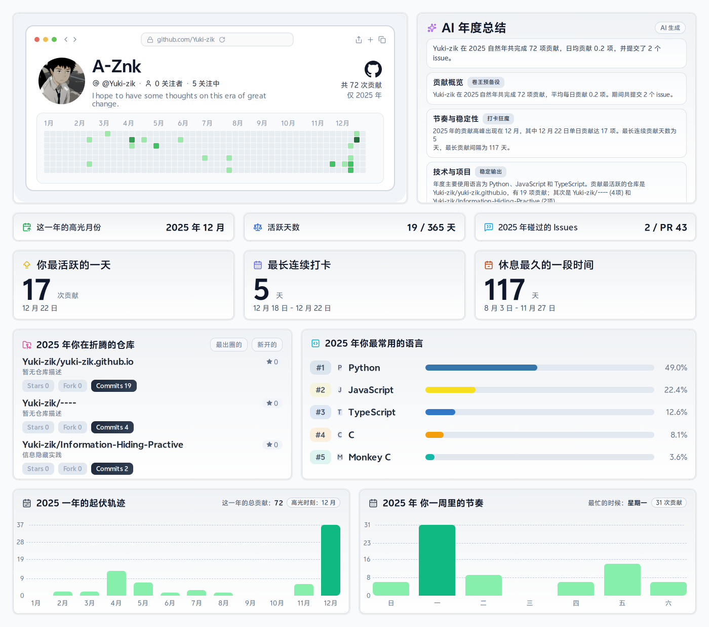

<div align="center">

[English](README.md) | [简体中文](README.zh-CN.md)

</div>

# GitHub Annual Report Generator

A local tool to generate your personal GitHub annual report, featuring rolling 365-day statistics, AI-powered summaries, and beautiful visualizations.

<p align="center">
  
</p>

## Features

- 📊 **Rolling Stats**: Tracks your last 365 days of activity by default, perfectly capturing your recent momentum.
- 🤖 **AI Summary**: Uses OpenAI to analyze your activity and generate a personalized annual review (with fallback rules).
- 🖼️ **High-Quality Assets**: Generates retina-ready PNG and GitHub-compatible SVG reports.
- 🧰 **Local-First**: Ships without GitHub Actions workflows, so this repository can stay as a shareable open-source template.

## Quick Start

### 1. Clone or Use the Template
Clone the repository, or click **[Use this template](https://github.com/new?template_name=github-annual-report-generator&template_owner=Yuki-zik)** to create your own copy.

### 2. Configure Environment
Set the following environment variables in `.env` or your shell:

| Variable | Required | Description |
|---|---|---|
| `GH_STATS_TOKEN` | Yes | A GitHub Personal Access Token (PAT). Suggested scopes: `read:user`, `repo`, `read:org`. |
| `GH_USERNAME` | Yes | The GitHub username to generate the report for. |
| `OPENAI_API_KEY` | No | OpenAI API Key. Required for AI summaries. |
| `OPENAI_BASE_URL` | No | Custom base URL for OpenAI-compatible APIs (default: `https://api.openai.com/v1`). |
| `OPENAI_MODEL` | No | Custom model name (default: `gpt-4o-mini`). |

### 3. Generate Assets

```bash
npm install
node scripts/year-report/generate-report.mjs
```

### 4. Display on Profile
After generation, embed the report from `assets/` in your profile `README.md`:

```markdown
<picture>
  <source media="(prefers-color-scheme: dark)" srcset="./assets/github-annual-report.svg">
  
</picture>
```

See [examples/PROFILE_README.md](examples/PROFILE_README.md) for a full example.

## Local Development

1. Clone the repository.
2. Install dependencies: `npm install`.
3. Set environment variables in `.env` or shell (`GH_STATS_TOKEN`, `GH_USERNAME`).
4. Run report generation:
   ```bash
   node scripts/year-report/generate-report.mjs --dry-run
   ```
5. Run tests:
   ```bash
   npm run test:all
   ```

## Customization

- **Layout**: Modify `scripts/year-report/design-spec.mjs` and `report-html.mjs` to adjust styles.

## Attribution

- Design inspired by Green-Wall: https://github.com/Codennnn/Green-Wall
