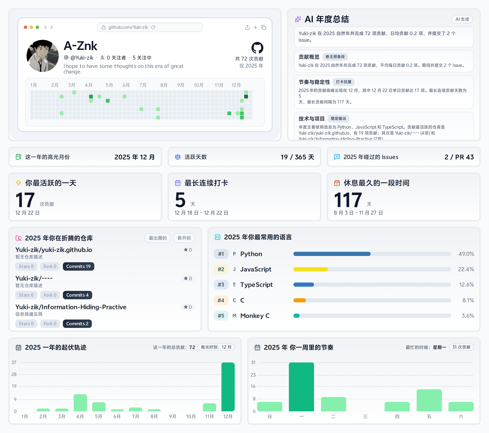

[English](PROFILE_README.md) | [简体中文](PROFILE_README.zh-CN.md)

# Yuki-zik

  

## 关于我

- 专注于自动化、前后端工程和实用工具开发。
- 基于实际需求构建可复用且易维护的项目。
- 追求快速迭代与稳定交付。

## 自动更新

- 年度报告生成器：`node scripts/year-report/generate-report.mjs`
- 计划任务：`.github/workflows/yearly-report.yml` (每周)
- 数据源：GitHub GraphQL API（使用 PAT 可包含私有贡献）
- AI 摘要：OpenAI 兼容接口，失败时自动降级为基于规则的摘要

## 贡献贪吃蛇

## 链接

- GitHub: https://github.com/Yuki-zik
- Telegram: https://t.me/A_Znkv

## 致谢

- 设计灵感来源于 Green-Wall: https://github.com/Codennnn/Green-Wall
